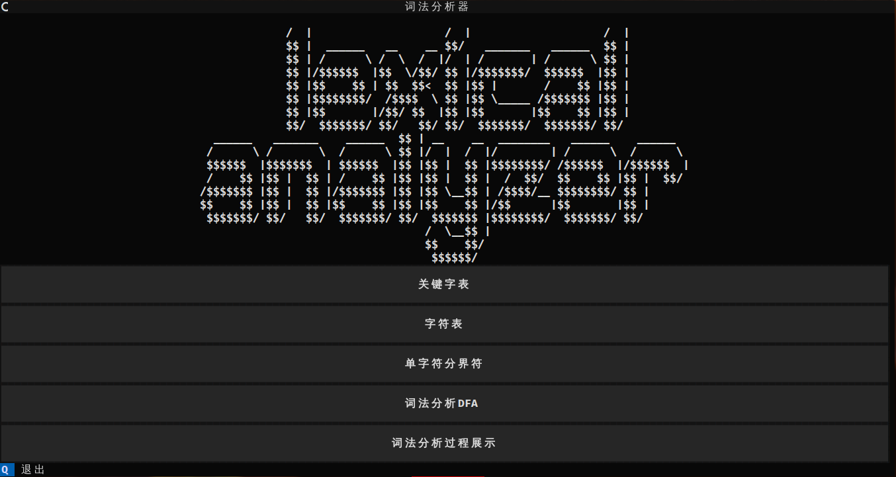
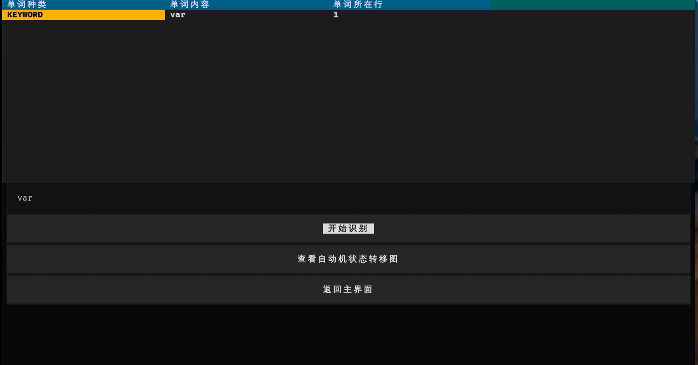
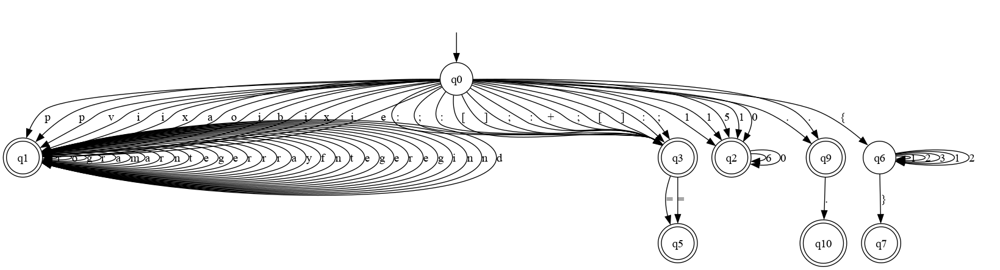

# Simple-Lexer
## Intro
A **Simple** lexer ~~for pascal word~~  
    Implement with python  

### About
```
./
├── app.py(Main program)
├── image
│   ├── dfa.gv
│   ├── dfa.png(States Transition Diagrams)
├── MainApp.css(style)
├── source.txt(source code)
└── src
    ├── DFA.py(DFA lexer)
    └── sheet.py(With some keywords,sheet,table)
```


## **Required**:
 [ Graphviz ](https://www.graphviz.org/),[Textual](https://github.com/Textualize/textual)
## **Usage**:
 ```shell
 python app.py
 ```


---

## Some Screen short:  



<center>Home_Screen</center>


<center>File analysis</center>



<center>word analysis</center>



<center>State Transition Diagrams</center>


